# 📄 compute_engine.md

## Google Compute Engine — Complete Beginner Guide

## 1. What is Compute Engine?

**Compute Engine** is the virtual machine (VM) service of **Google Cloud Platform**.

It allows you to create and run **virtual servers** on Google’s global infrastructure with **full control over the operating system and runtime**.

Think of Compute Engine as:

> “Renting a powerful computer in Google’s data center, configurable exactly the way you want.”

---

## 2. What is a Virtual Machine (VM)?

A **Virtual Machine (VM)** is a **software-based computer** that behaves like a physical machine.

A VM has:

- CPU
- Memory (RAM)
- Disk (storage)
- Network interface
- Operating System

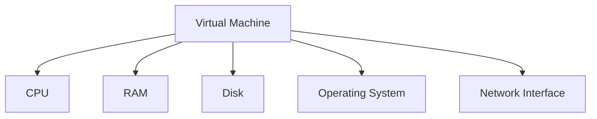

Multiple VMs can run on the same physical server, fully isolated from each other.

---

## 3. Why Use Compute Engine?

You choose Compute Engine when you need:

- Full OS-level control
- SSH / RDP access
- Custom software installation
- Predictable performance
- Legacy or monolithic applications

Typical use cases:

- Web servers
- Application servers
- Databases (self-managed)
- Dev/Test environments
- Lift-and-shift migrations

---

## 4. Core Architecture of Compute Engine

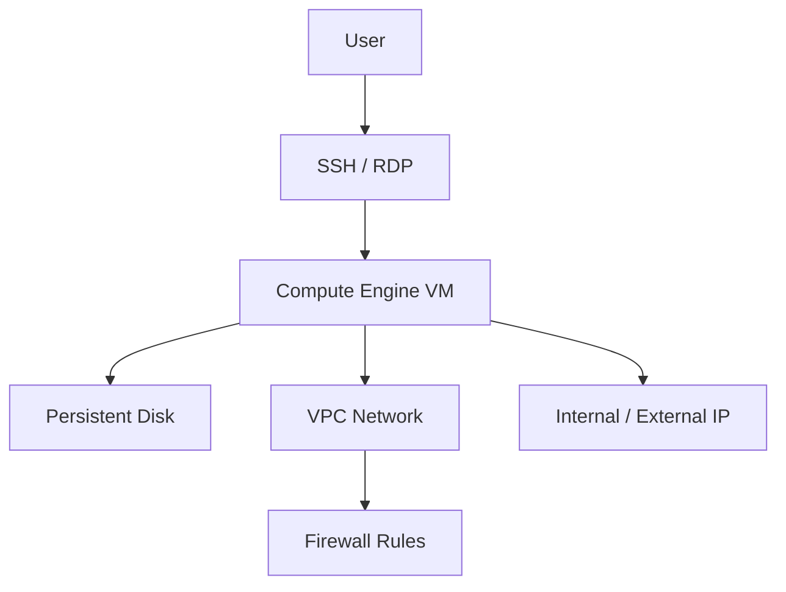

A VM does **not exist alone**. It is always attached to:

- A **zone**
- A **VPC network**
- One or more **disks**
- Firewall rules

---

## 5. Regions and Zones (Very Important)

### Region

A **region** is a geographical location:

- asia-south1
- us-central1
- europe-west1

### Zone

A **zone** is an isolated deployment area inside a region:

- asia-south1-a
- asia-south1-b

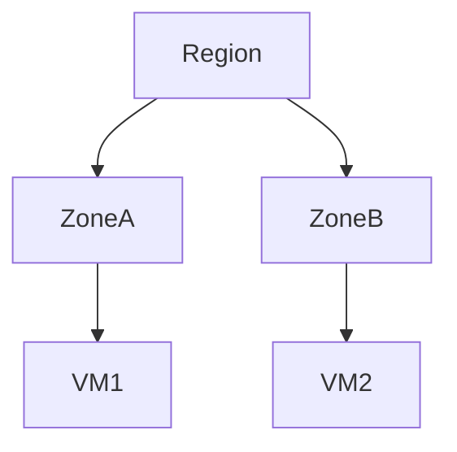

**Key rule:**
A VM always lives in **one zone**.

---

## 6. Components of a Compute Engine VM

Let’s break down **every component** of a VM.

---

### 6.1 Machine Type (CPU + Memory)

This defines **how powerful** your VM is.

Examples:

- e2-micro
- e2-medium
- n2-standard-4

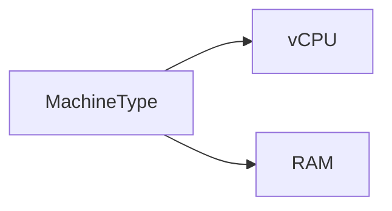

#### Types of machine families:

- **E2** – Cost-optimized, general workloads
- **N2** – Balanced performance
- **C2** – Compute-intensive
- **M** – Memory-optimized

Beginner rule:

> Start with **E2** unless you have special needs.

---

### 6.2 Boot Disk (Operating System)

The **boot disk** contains the OS.

Common OS images:

- Ubuntu
- Debian
- CentOS
- RHEL
- Windows Server

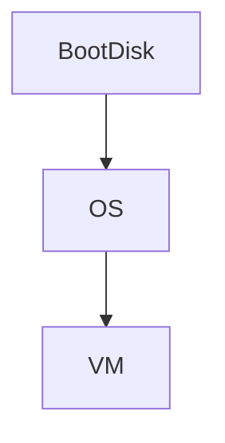

Options you choose:

- OS type
- Disk size
- Disk type

---

### 6.3 Persistent Disks (Storage)

Persistent Disks are **network-attached disks**.

Types:

- Standard (HDD)
- Balanced SSD
- SSD (high performance)

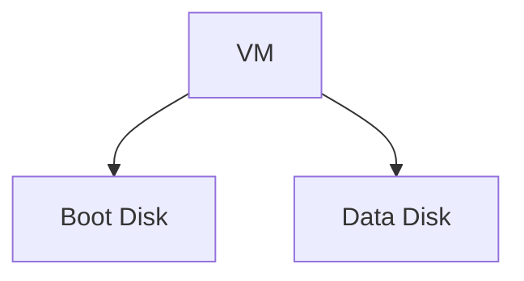

Important properties:

- Data persists even if VM stops
- Can be resized
- Can be attached/detached

---

### 6.4 Networking (VPC, IPs, NIC)

Each VM connects to a **VPC network** via a **network interface (NIC)**.

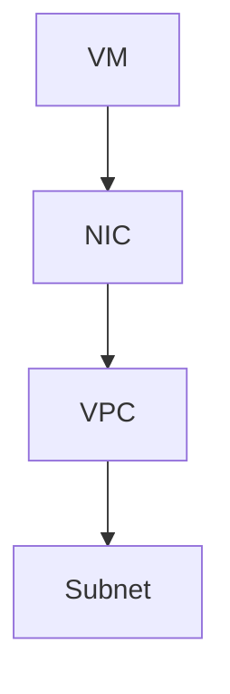

#### IP Types

- **Internal IP** – Used inside the VPC
- **External IP** – Used to access from the internet

External IPs can be:

- Ephemeral (changes)
- Static (reserved)

---

### 6.5 Firewall Rules

Firewall rules control **allowed traffic**.

They are:

- Defined at VPC level
- Applied using **tags or service accounts**

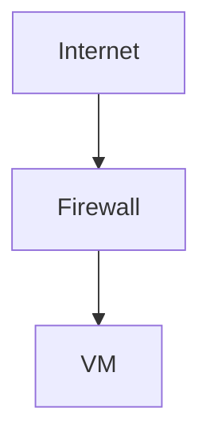

Example:

- Allow TCP:22 → SSH
- Allow TCP:80 → HTTP

---

### 6.6 Service Account & IAM

A VM can have a **service account** attached.

Purpose:

- Allow VM to access GCP services securely

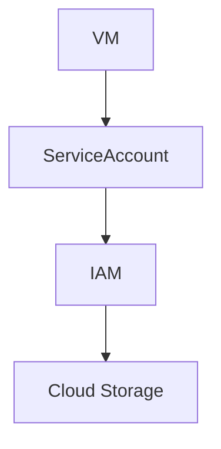

Never hardcode credentials inside a VM.

---

### 6.7 Metadata & Startup Scripts

Metadata lets you configure VM behavior.

Common uses:

- Startup scripts
- Configuration flags
- Environment variables

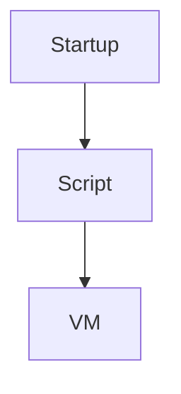

Example:

- Install Nginx on first boot
- Configure application automatically

---

## 7. How to Create a VM (Conceptual Flow)

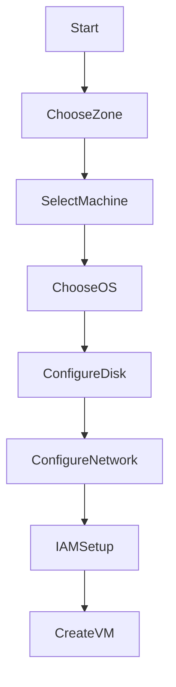

---

## 8. VM Creation Options (Explained Simply)

When creating a VM, you choose:

### 1. Name

Logical identifier for the VM.

### 2. Region & Zone

Determines:

- Latency
- Availability
- Cost

### 3. Machine Configuration

- Machine family
- vCPU count
- Memory

### 4. Boot Disk

- OS image
- Disk type
- Disk size

### 5. Identity & API Access

- Service account
- Access scopes

### 6. Networking

- VPC
- Subnet
- External IP

### 7. Firewall

- Allow HTTP/HTTPS
- Custom rules

### 8. Advanced Options

- Startup scripts
- Preemptibility
- Shielded VM
- Confidential VM

---

## 9. VM Lifecycle

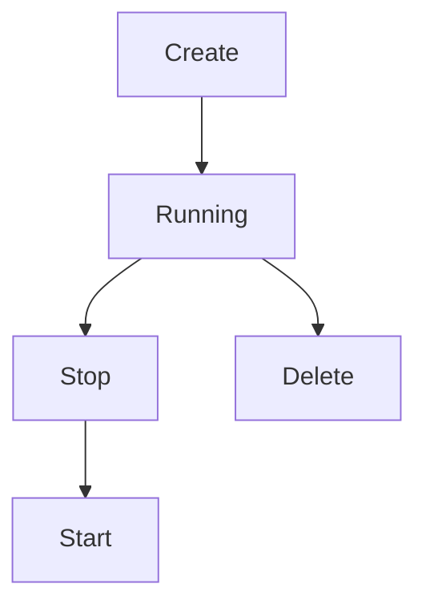

Key behaviors:

- **Stop** → disk persists
- **Delete** → disk may be deleted (if configured)

---

## 10. VM Availability & Scaling

### Single VM

- Simple
- No high availability

### Managed Instance Group (MIG)

- Multiple identical VMs
- Autoscaling
- Self-healing

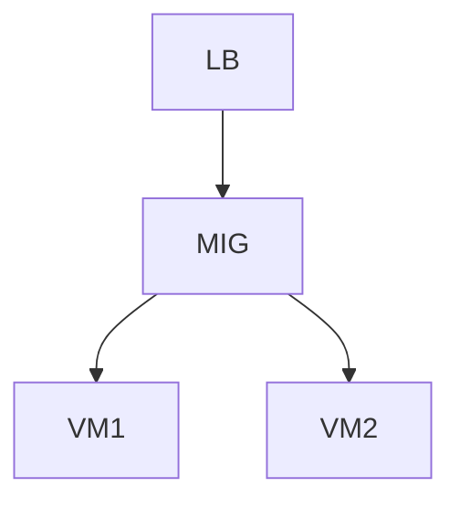

---

## 11. Pricing Basics (Conceptual)

You pay for:

- vCPU time
- Memory
- Disk storage
- Network egress

Billing is **per second** (with minimums).

---

## 12. When NOT to Use Compute Engine

Avoid Compute Engine if:

- You only need HTTP APIs → Cloud Run
- You want zero ops → App Engine
- You need event-driven logic → Cloud Functions

---

## 13. Beginner Mental Model Summary

- Compute Engine = **maximum control**
- VM = **virtual computer**
- You manage **OS, patches, scaling**
- Best for **custom and legacy workloads**

---
