# VM Access and Lifecycle in Google Compute Engine

This document explains **how you access a Virtual Machine (VM)** and **how a VM behaves throughout its entire lifecycle** in **Google Cloud Platform**.

---

## 1. What Does “VM Access” Mean?

**VM access** is how:

- Humans connect to a VM (SSH / RDP)
- Applications connect to a VM (network traffic)
- A VM accesses other GCP services (IAM)

Access is always controlled and **never open by default**.

---

## 2. Types of VM Access

There are **three major access categories**.

---

### 2.1 Human Access (Admin / Developer)

This is how **you log in** to a VM.

#### Linux VM

- Access method: **SSH**
- Default port: `22`

#### Windows VM

- Access method: **RDP**
- Default port: `3389`

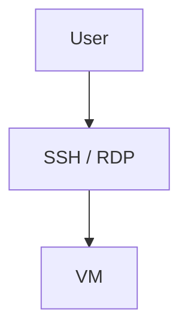

#### How SSH Access Works (Conceptually)

1. You authenticate using:

   - SSH key
   - OS Login (IAM-based)

2. Firewall allows the port
3. VM OS allows the user

> **Important:**
> Firewall rules alone do NOT grant access.
> OS authentication is always required.

---

### 2.2 Network Access (Application Traffic)

This is how **applications or users reach services running on the VM**.

Examples:

- HTTP (port 80)
- HTTPS (port 443)
- Custom app ports (e.g., 8080)

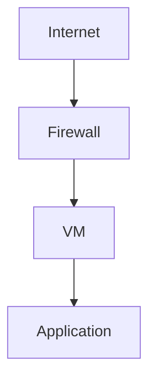

Access depends on:

- Firewall rules
- VM network interface
- Whether the VM has an external IP

---

### 2.3 VM → GCP Service Access (IAM)

VMs often need to access:

- Cloud Storage
- Databases
- Pub/Sub
- APIs

This is done using a **service account**, not passwords.

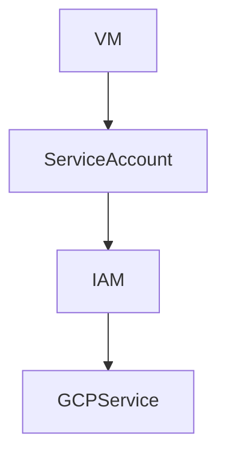

This is **machine identity**, not human identity.

---

## 3. VM Lifecycle — High-Level View

A VM is **not static**. It moves through multiple **states** from creation to deletion.

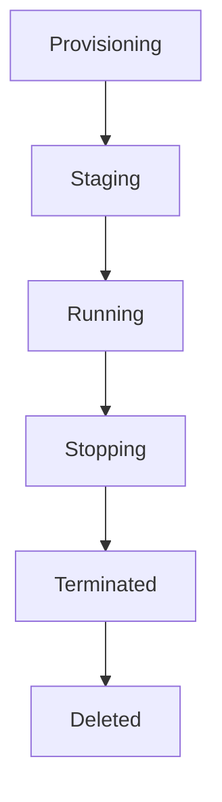

But this is only the **simplified view**.
Let’s go deeper.

---

## 4. Full VM Lifecycle States (Beginner Explanation)

Below are **all VM states**, what they mean, and when they occur.

---

### 4.1 Provisioning

**What it means:**

- Google is allocating resources
- Disk is being attached
- Network is being prepared

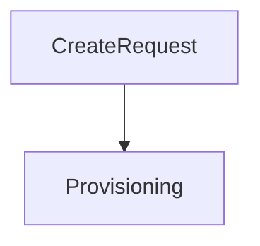

You **cannot access** the VM yet.

---

### 4.2 Staging

**What it means:**

- VM exists
- OS is booting
- Startup scripts may run

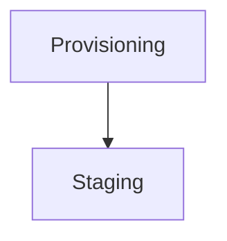

Think of this as:

> “The computer is turning on.”

---

### 4.3 Running

**What it means:**

- VM is fully operational
- OS is running
- Applications can serve traffic
- SSH / RDP works

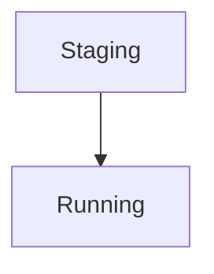

This is the **normal active state**.

---

### 4.4 Repairing

**What it means:**

- VM failed health checks
- Google is attempting recovery
- Common in Managed Instance Groups

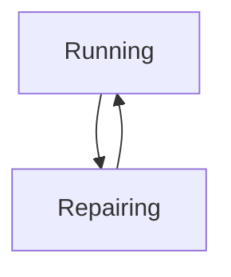

Used mostly in **self-healing architectures**.

---

### 4.5 Suspending

**What it means:**

- VM memory (RAM) is saved
- CPU stops
- Disk remains attached

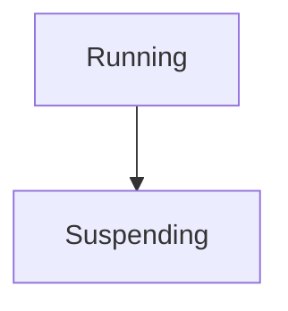

Similar to **hibernation** on a laptop.

---

### 4.6 Suspended

**What it means:**

- VM is paused
- RAM snapshot stored
- Faster resume than start

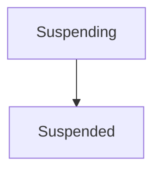

Billing:

- Storage charged
- No CPU charges

---

### 4.7 Stopping

**What it means:**

- OS shutdown is initiated
- Shutdown scripts run
- VM prepares to stop

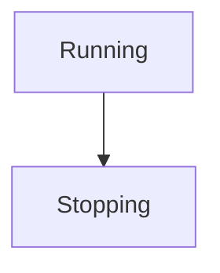

---

### 4.8 Terminated (Stopped)

**What it means:**

- VM is powered off
- Disk persists
- No CPU billing

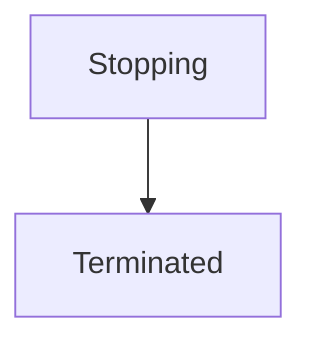

You can restart from here.

---

### 4.9 Deleted

**What it means:**

- VM is permanently removed
- Resources are released
- Boot disk may be deleted

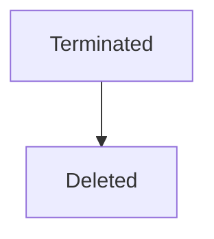

This is **irreversible**.

---

## 5. VM Lifecycle Actions (API / Console Actions)

Each state transition happens due to an **action**.

| Action               | Effect               |
| -------------------- | -------------------- |
| `instance.start()`   | Terminated → Running |
| `instance.stop()`    | Running → Terminated |
| `instance.reset()`   | Hard reboot          |
| `instance.suspend()` | Running → Suspended  |
| `instance.resume()`  | Suspended → Running  |
| `instance.delete()`  | Any → Deleted        |

---

## 6. Full VM Lifecycle Diagram (With Actions)

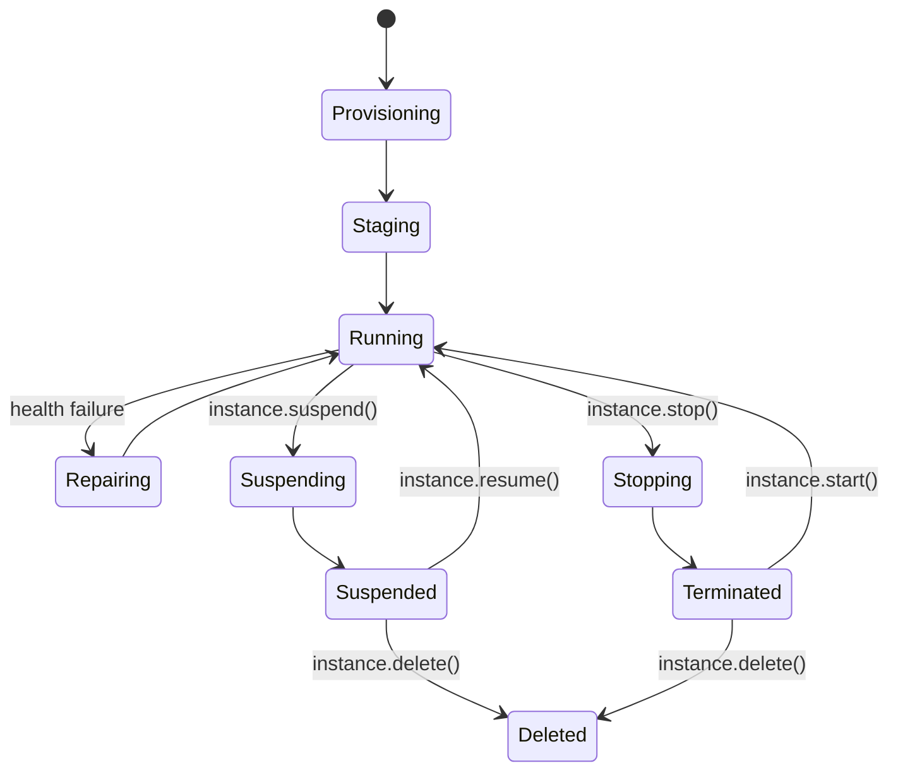

---

## 7. Startup and Shutdown Scripts (Very Important)

These scripts **automate VM behavior**.

---

### 7.1 Startup Scripts

**When they run:**

- During **Staging**
- Every time VM starts or restarts

**Common uses:**

- Install packages
- Start services
- Pull code
- Configure applications

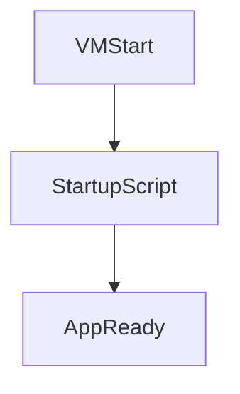

Example:

- Install Nginx automatically

---

### 7.2 Shutdown Scripts

**When they run:**

- During **Stopping**
- Before VM terminates

**Common uses:**

- Graceful app shutdown
- Upload logs
- Notify systems

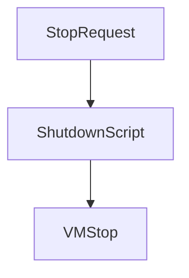

> Startup and shutdown scripts are defined using **VM metadata**.

---

## 8. Patch Activities (OS Updates & Maintenance)

### What is Patching?

Patching means:

- Updating OS packages
- Applying security fixes
- Fixing vulnerabilities

---

### 8.1 Manual Patching

You:

- SSH into VM
- Run OS update commands
- Restart services manually

Used in:

- Small systems
- Dev environments

---

### 8.2 Automated Patching

Google provides **OS Patch Management**:

- Schedule patch windows
- Apply updates automatically
- Generate reports

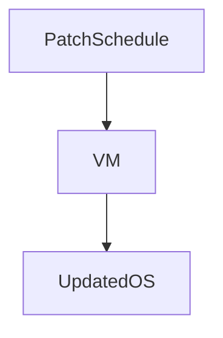

Best practice:

> Patch regularly to avoid security risks.

---

### 8.3 Patch Impact on Lifecycle

- Patching may require:

  - Restart
  - Temporary downtime

- In MIGs, rolling updates are used

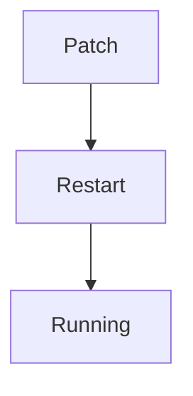

---
