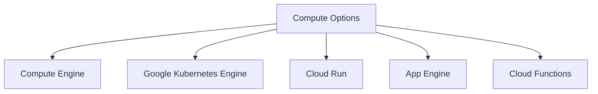
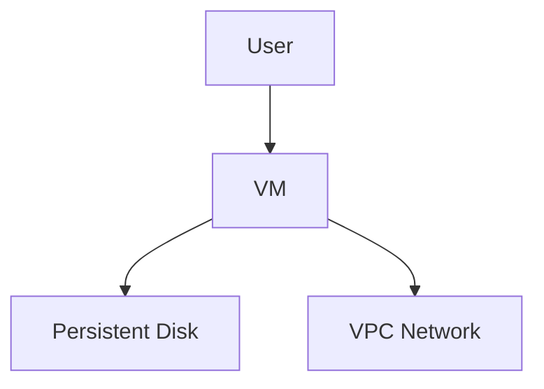
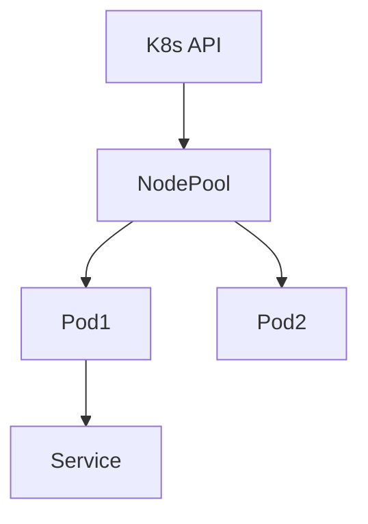
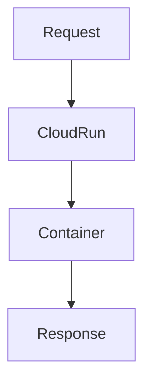
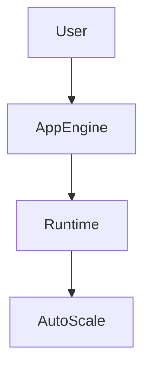
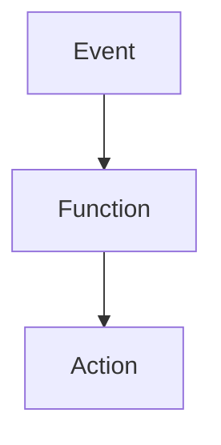

# Compute Options in Google Cloud Platform

GCP provides **multiple compute services**, each optimized for a specific workload pattern. Choosing the right option is a **design decision**, not just a technical one.

This document explains **what each compute option is**, **why it exists**, and **when to use it**.

---

## High-Level Compute Options

---

## 1. Compute Engine (Virtual Machines)

### What it is

Compute Engine provides **virtual machines** running on Google infrastructure with **full OS-level control**.

### Characteristics

- You manage OS, runtime, patches
- Supports Linux and Windows
- Persistent disks and custom machine types
- Manual or autoscaling via instance groups

### Typical Use Cases

- Legacy applications
- Custom system software
- Self-managed databases
- Lift-and-shift migrations

---

## 2. Google Kubernetes Engine (GKE)

### What it is

GKE is a **managed Kubernetes service** for orchestrating containers at scale.

### Characteristics

- Google manages control plane
- You manage workloads and configs
- Advanced autoscaling
- Production-grade container orchestration

### Typical Use Cases

- Microservices architectures
- CI/CD-driven platforms
- Multi-service applications
- High availability systems

---

## 3. Cloud Run (Serverless Containers)

### What it is

Cloud Run executes **containers in a fully serverless model**.

### Characteristics

- No cluster management
- Scales to zero
- HTTP-based workloads
- Pay-per-request

### Typical Use Cases

- REST APIs
- Backend-for-frontend (BFF)
- Internal tools
- Event-triggered container logic

---

## 4. App Engine (Platform-as-a-Service)

### What it is

App Engine runs applications in **managed runtimes**, abstracting infrastructure entirely.

### Environments

- **Standard** – Fully sandboxed, fast scaling
- **Flexible** – Docker-based, more control

### Typical Use Cases

- Traditional web applications
- Rapid MVP development
- Applications with predictable traffic

---

## 5. Cloud Functions (Function-as-a-Service)

### What it is

Cloud Functions execute **single-purpose functions** triggered by events.

### Characteristics

- Stateless
- Short execution time
- Event-driven
- Minimal configuration

### Typical Use Cases

- Automation
- Webhooks
- Background processing
- Event pipelines

---

## Comparison Table

| Service         | Control   | Scaling            | Operational Effort |
| --------------- | --------- | ------------------ | ------------------ |
| Compute Engine  | Very High | Manual / Autoscale | High               |
| GKE             | High      | Advanced           | Medium–High        |
| Cloud Run       | Medium    | Automatic          | Low                |
| App Engine      | Medium    | Automatic          | Very Low           |
| Cloud Functions | Low       | Automatic          | Minimal            |

---

## Mental Model for Choosing Compute

- **Need OS or SSH?** → Compute Engine
- **Containers + full orchestration?** → GKE
- **Containers without infra management?** → Cloud Run
- **Simple web app, fast deployment?** → App Engine
- **Event-driven logic only?** → Cloud Functions

---
