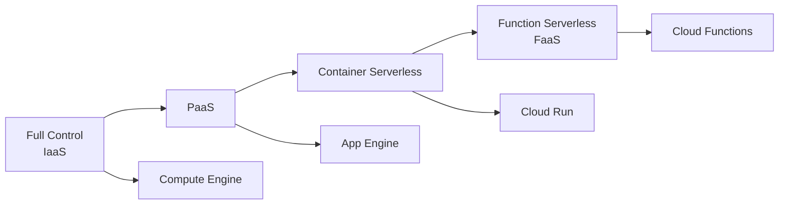
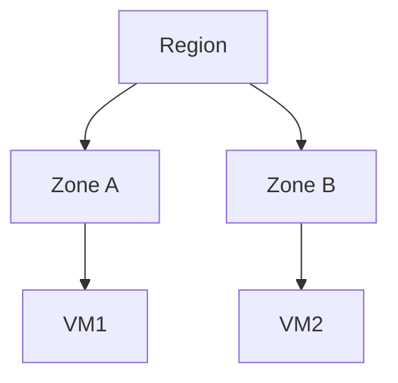
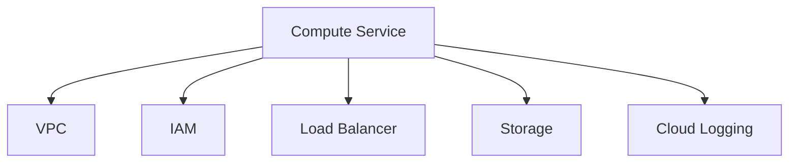

# Overview of Compute in Google Cloud Platform

In **Google Cloud Platform**, _compute services_ define **how and where your application code executes**. This includes the infrastructure model, level of control, scaling behavior, and operational responsibility.

This document provides a **high-level conceptual overview** of compute in GCP before diving into individual services.

---

## What “Compute” Means in Cloud

At its core, compute answers four questions:

1. **Where does my code run?**
2. **Who manages the servers and OS?**
3. **How does my application scale?**
4. **How am I billed for execution?**

In traditional systems, all of this was handled on physical servers. In GCP, these responsibilities are **abstracted into managed compute models**.

---

## Compute Responsibility Spectrum

GCP compute services exist on a **spectrum of control vs convenience**.

As you move right:

- Operational responsibility decreases
- Scaling becomes automatic
- Flexibility reduces
- Abstraction increases

---

## Core Compute Models in GCP

| Model            | Description                           | Example Services |
| ---------------- | ------------------------------------- | ---------------- |
| IaaS             | Virtual machines with full OS control | Compute Engine   |
| PaaS             | Managed runtimes for applications     | App Engine       |
| Container-native | Managed container execution           | Cloud Run, GKE   |
| Serverless       | Event-driven functions                | Cloud Functions  |

---

## Regional and Zonal Context

All compute services operate within GCP’s **region and zone architecture**:

- **Region**: Geographical area (e.g., asia-south1)
- **Zone**: Isolated deployment area inside a region

This design enables:

- High availability
- Fault isolation
- Disaster recovery architectures

---

## How Compute Integrates with Other GCP Services

Compute services rarely operate alone. They integrate tightly with:

- **VPC Networking** – IPs, routes, firewalls
- **IAM** – Identity and access control
- **Load Balancing** – Traffic distribution
- **Cloud Storage / Databases** – Persistent data
- **Monitoring & Logging** – Observability

---

## Purpose of This Documentation Set

This compute documentation is designed to:

- Start from **first principles**
- Build intuition before configurations
- Connect compute decisions to **real architectures**
- Prepare you for **GCP certifications and production design**

Next, we break down **all available compute options** and how to choose among them.

---
