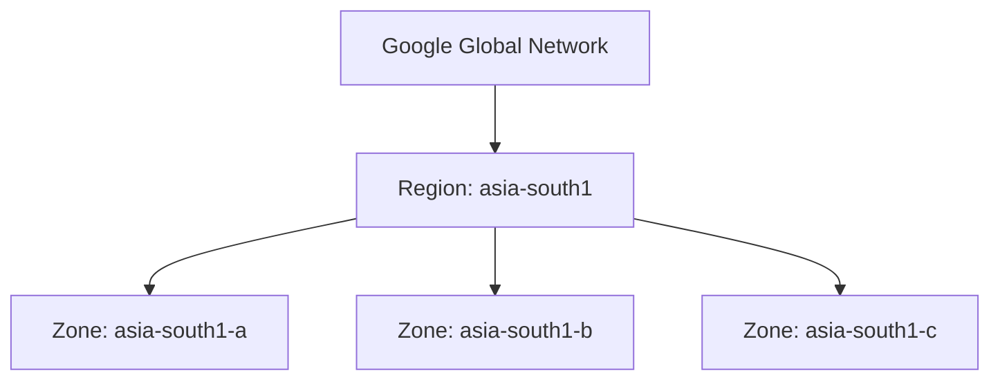
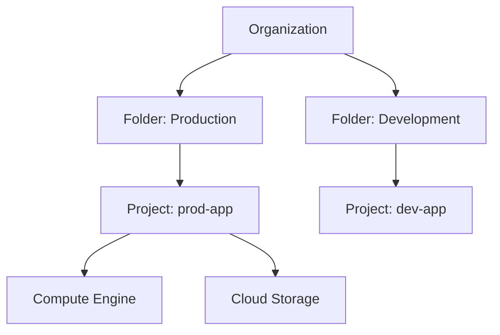
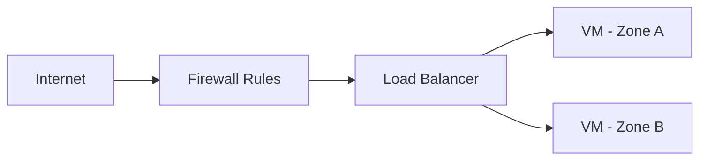

# Google Cloud Platform (GCP) – Fundamentals

> This document serves as the **foundational reference** for Google Cloud Platform (GCP). It explains core concepts, services, architecture, and design principles in depth. This file is intended to be the **starting point** for structured GCP learning and future advanced notes.

---

## 1. What is Google Cloud Platform?

**Google Cloud Platform (GCP)** is a suite of cloud computing services offered by Google that runs on the same global infrastructure used for Google Search, Gmail, YouTube, and other Google products.

GCP provides:

- Compute power
- Storage
- Networking
- Databases
- Data analytics
- Machine learning
- DevOps & CI/CD tooling
- Security and identity services

### Key Characteristics

- **Global-scale infrastructure**
- **High availability and fault tolerance**
- **Pay-as-you-go pricing model**
- **Strong integration with Kubernetes and containers**
- **Enterprise-grade security**

---

## 2. GCP Global Infrastructure

GCP infrastructure is designed for **high availability, low latency, and fault isolation**.

### 2.1 Regions

A **Region** is a specific geographic location (e.g., `us-central1`, `asia-south1`).

- Regions are independent
- Data residency and compliance depend on region
- Services are deployed per region

### 2.2 Zones

A **Zone** is an isolated deployment area within a region.

- Each region has **multiple zones**
- Zones are physically separate data centers
- Failures are isolated to a zone

### 2.3 Multi-Region

Some services are **multi-regional**, meaning data is replicated across multiple regions.

---

### Infrastructure Hierarchy Diagram



---

## 3. Resource Hierarchy in GCP

GCP uses a **logical resource hierarchy** to manage permissions, billing, and policies.

### Hierarchy Levels

1. **Organization**
2. **Folder** (optional)
3. **Project**
4. **Resources**

### 3.1 Organization

- Represents a company or enterprise
- Linked to a Google Workspace or Cloud Identity account
- Centralized policy and IAM control

### 3.2 Folder

- Optional grouping mechanism
- Used for environments (prod, dev, staging)
- Enables inheritance of IAM policies

### 3.3 Project

- Fundamental unit of GCP
- Every resource belongs to exactly one project
- Contains:

  - Billing configuration
  - APIs and services
  - IAM policies

### 3.4 Resources

- Compute Engine VMs
- Cloud Storage buckets
- VPC networks
- Databases

---

### Resource Hierarchy Diagram



---

## 4. Identity and Access Management (IAM)

**IAM** controls **who** can do **what** on **which resource**.

### 4.1 Core IAM Concepts

#### Members

- Google Account
- Service Account
- Google Group
- Domain

#### Roles

A role is a collection of permissions.

Types of roles:

- **Primitive Roles** (Owner, Editor, Viewer)
- **Predefined Roles** (e.g., `roles/compute.admin`)
- **Custom Roles** (user-defined)

#### Permissions

- Atomic actions (e.g., `compute.instances.create`)

### IAM Policy Structure

```json
{
  "bindings": [
    {
      "role": "roles/compute.admin",
      "members": ["user:admin@example.com"]
    }
  ]
}
```

### Principle of Least Privilege

Always grant the **minimum permissions** required.

---

## 5. GCP Networking Fundamentals

### 5.1 Virtual Private Cloud (VPC)

A **VPC** is a global, private, software-defined network.

Key properties:

- Global scope
- Subnets are **regional**
- Supports IPv4 and IPv6

### 5.2 Subnets

- Regional IP ranges
- Can be auto-mode or custom-mode

### 5.3 Firewall Rules

- Stateful
- Allow or deny traffic
- Applied at the VPC level

### 5.4 Routes

- Define how traffic leaves the network

---

### VPC Architecture Diagram



---

## 6. Compute Services Overview

### 6.1 Compute Engine (IaaS)

- Virtual Machines
- Full OS control
- Custom machine types
- Persistent disks

Use cases:

- Legacy applications
- Custom environments

### 6.2 Google Kubernetes Engine (GKE)

- Managed Kubernetes
- Auto-scaling
- Self-healing

### 6.3 App Engine (PaaS)

- Fully managed
- No server management
- Supports standard and flexible environments

### 6.4 Cloud Functions (FaaS)

- Event-driven
- Stateless
- Auto-scaled

---

## 7. Storage Services

### 7.1 Cloud Storage

Object storage with multiple classes:

- Standard
- Nearline
- Coldline
- Archive

Key features:

- Global namespace
- Lifecycle rules
- Object versioning

### 7.2 Persistent Disk

- Block storage for VMs
- SSD and HDD options

### 7.3 Filestore

- Managed NFS

---

## 8. Database Services

### Relational Databases

- Cloud SQL (MySQL, PostgreSQL, SQL Server)
- AlloyDB

### NoSQL Databases

- Firestore
- Bigtable

### Analytics Databases

- BigQuery

---

## 9. Billing and Pricing

### Billing Concepts

- Billing Account
- Project-level billing association
- Budgets and alerts

### Pricing Model

- Pay per use
- Sustained use discounts
- Committed use discounts

---

## 10. Security Fundamentals

### Shared Responsibility Model

- Google secures the **cloud**
- Customer secures **what’s in the cloud**

### Security Services

- Cloud IAM
- Cloud Armor
- Secret Manager
- Cloud KMS

---

## 11. Monitoring and Logging

### Cloud Monitoring

- Metrics
- Alerts
- Dashboards

### Cloud Logging

- Centralized logs
- Log-based metrics

---

## 12. DevOps and CI/CD in GCP

- Cloud Build
- Artifact Registry
- Cloud Deploy
- Integration with GitHub/GitLab

---

## 13. Design Principles and Best Practices

- Use managed services where possible
- Design for failure
- Automate everything (IaC)
- Use labels and naming conventions
- Separate environments using projects

---

## 14. What Comes Next

This fundamentals file is the base for future documents:

- `compute.md`
- `networking.md`
- `iam-security.md`
- `gke.md`
- `devops.md`
- `architecture-patterns.md`

---
