## 1. What “Networking” Means in GCP

In simple terms:

> **GCP networking defines how resources (VMs, databases, services) communicate with each other and with the internet—securely and reliably.**

Unlike traditional data centers:

- GCP networking is **software-defined**
- It is **global**, not tied to a single region
- You do not manage physical routers or switches

---

## 2. GCP Global Network

- Google owns a **private global fiber network**
- All regions are connected via Google’s backbone
- Traffic between regions stays **inside Google’s network**, not the public internet

### Why this matters

- Low latency
- High security
- Predictable performance

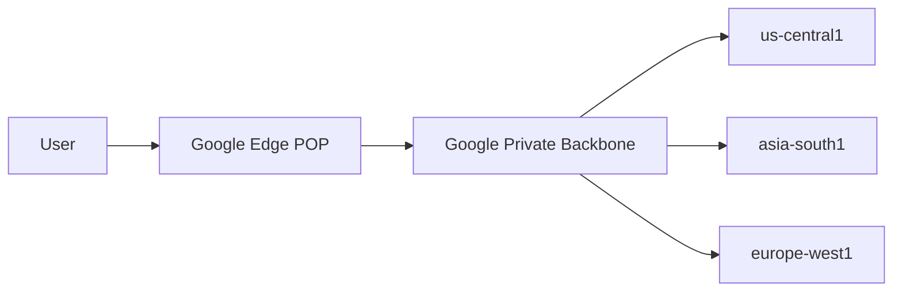

---

## 3. Virtual Private Cloud (VPC)

### What is a VPC?

A **VPC** is a **logically isolated private network** in GCP where you deploy your cloud resources.

Think of it as:

- Your **own private data center network**
- Defined using IP ranges (CIDR blocks)

### Key properties

- **Global** (spans all regions)
- You create subnets per region
- Resources in different regions can talk **without VPN**

### Example

```
VPC: my-vpc
IP Range: 10.0.0.0/8
```

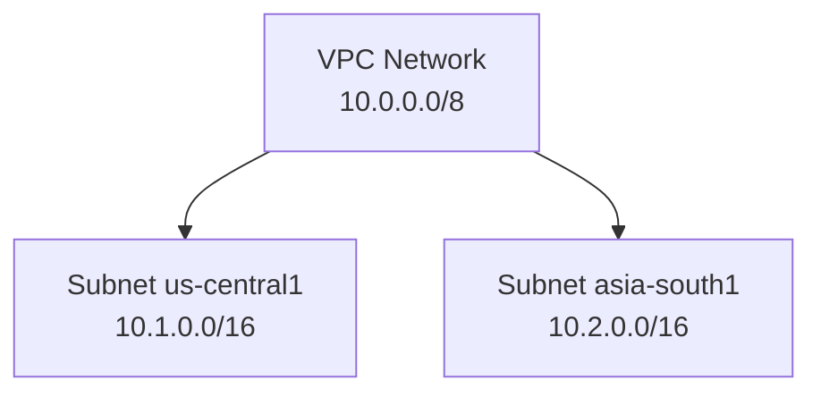

---

## 4. Subnets (Regional Network Segments)

### What is a Subnet?

A **subnet** is a **regional slice of a VPC**.

- Each subnet belongs to **one region**
- Defines IP addresses for resources in that region

### Why subnets exist

- Logical separation
- Better IP management
- Regional control

### Example

```
VPC: my-vpc
Subnet-1 (us-central1): 10.1.0.0/16
Subnet-2 (asia-south1): 10.2.0.0/16
```

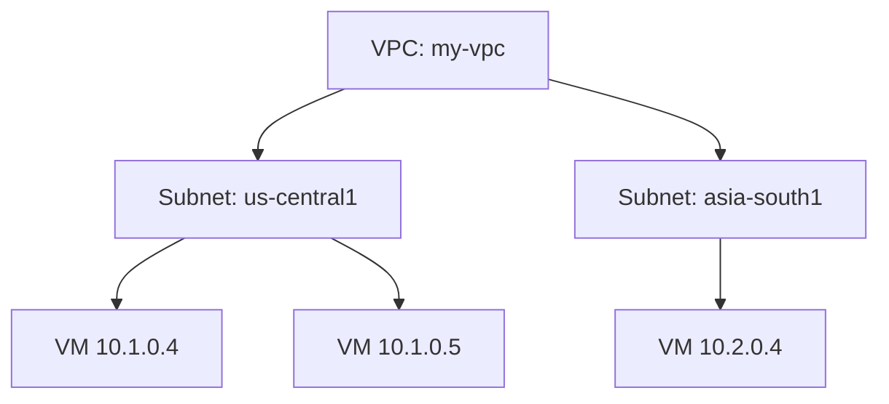

---

## 5. IP Addressing in GCP

### Types of IPs

| Type         | Purpose                  |
| ------------ | ------------------------ |
| Internal IP  | Communication inside VPC |
| External IP  | Internet access          |
| Static IP    | Fixed public address     |
| Ephemeral IP | Temporary public IP      |

### Internal IP

- Private
- Used between VMs, databases, services

### External IP

- Public
- Needed to access the internet

### Diagram: Internal vs External IP

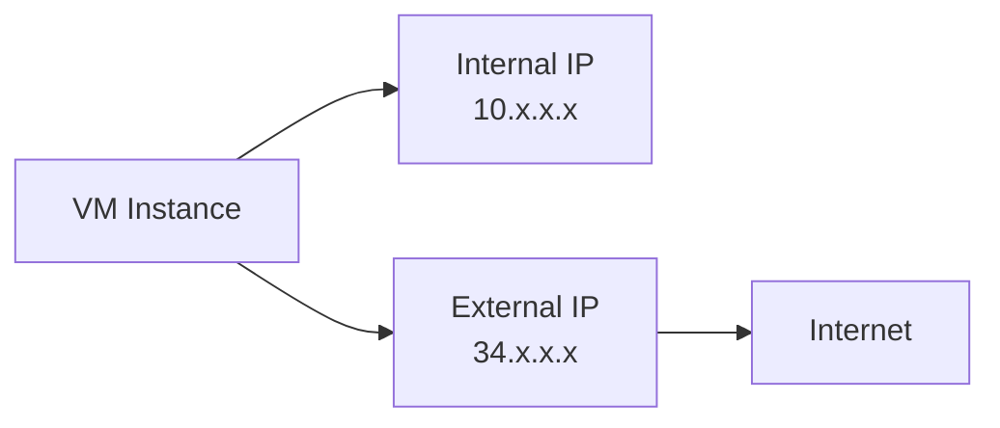

---

## 6. Routes (How Traffic Moves)

### What is a Route?

A **route** defines:

- Where traffic should go
- Based on destination IP

### Every route contains

- Destination CIDR
- Next hop (internet, VM, VPN, load balancer)

### Example

```
0.0.0.0/0 → Internet Gateway
```

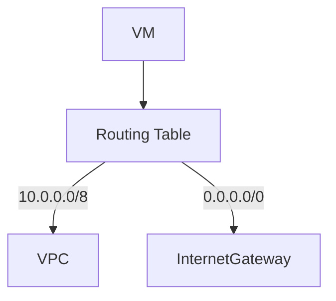

Meaning: all unknown traffic goes to the internet.

---

## 7. Firewall Rules (Traffic Control)

### What is a Firewall Rule?

Firewall rules decide:

- Who can talk to whom
- On which ports
- Using which protocols

They are:

- **Stateful**
- Applied at the **VPC level**
- Based on **allow rules only** (default deny)

### Example

Allow SSH:

```
Source: 0.0.0.0/0
Protocol: TCP
Port: 22
Target: VM tag = ssh
```

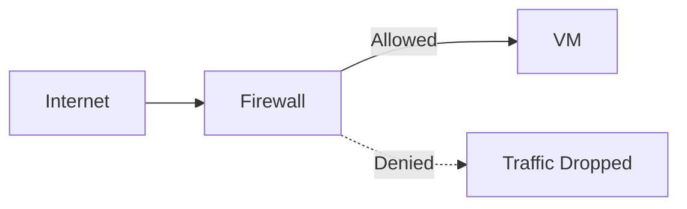

---

## 8. Internet Gateway

### What is it?

A **default, managed gateway** that allows:

- Outbound internet access
- Inbound traffic via external IPs

You do not create it manually—it exists automatically.

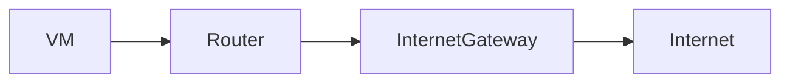

---

## 9. NAT (Network Address Translation)

### Problem NAT Solves

- You want **private VMs**
- But they still need **outbound internet**

### Solution: Cloud NAT

- Allows outbound internet
- Blocks inbound access
- More secure than public IPs

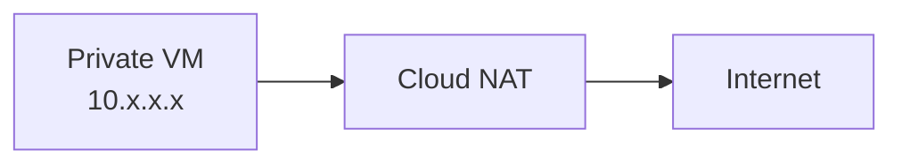

---

## 10. Load Balancing

### What is Load Balancing?

Distributes traffic across:

- Multiple VMs
- Multiple regions

### GCP Load Balancer Types

| Type              | Scope            |
| ----------------- | ---------------- |
| Global HTTP(S) LB | Worldwide        |
| Regional LB       | Single region    |
| TCP/UDP LB        | Non-HTTP traffic |

### Key Advantage

- Single anycast IP
- Traffic goes to nearest healthy backend

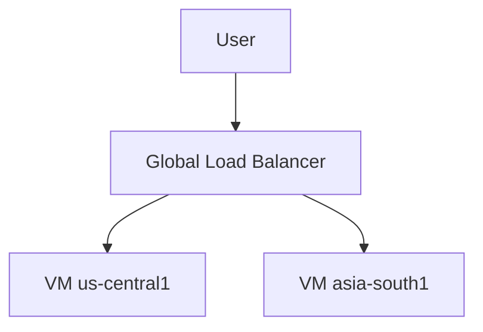

---

## 11. DNS (Cloud DNS)

### What is DNS?

Maps:

```
example.com → IP address
```

### Cloud DNS

- Managed DNS service
- Highly available
- Integrated with VPCs

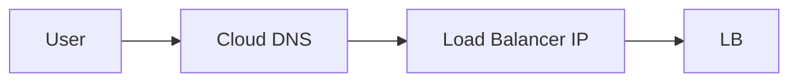

---

## 12. VPC Peering

### What is VPC Peering?

Connects:

- Two VPCs
- Using private IPs
- Without internet or VPN

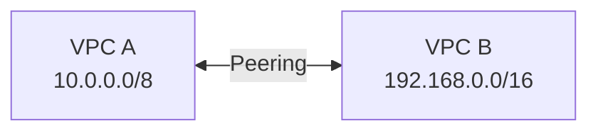

### Use case

- Microservices split across VPCs
- Org-level network separation

---

## 13. VPN (Hybrid Connectivity)

### What is VPN?

Secure encrypted tunnel between:

- On-premise network
- GCP VPC

### Types

- Classic VPN
- HA VPN (recommended)

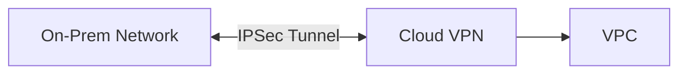

---

## 14. Interconnect (Dedicated Connectivity)

### What is Interconnect?

- Physical fiber connection
- From your data center to Google
- Very high bandwidth
- Low latency

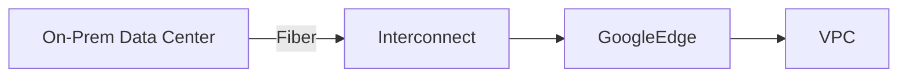

---

## 15. Shared VPC (Enterprise Networking)

### What is Shared VPC?

- One central VPC
- Used by multiple projects
- Centralized network control

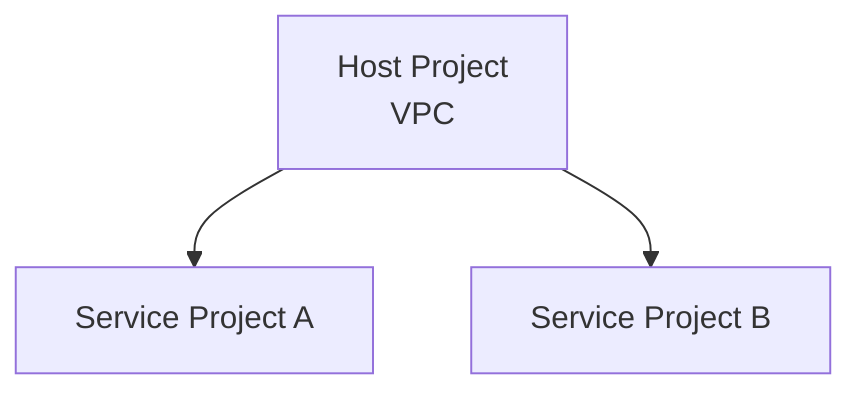

---

## 16. End-to-End Traffic Flow

### Complete Request Flow

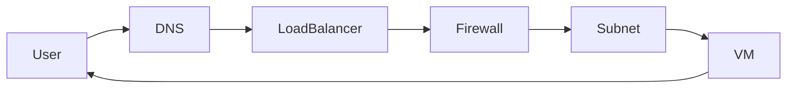

---
