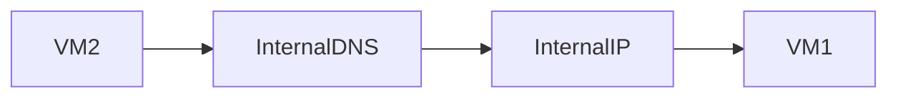
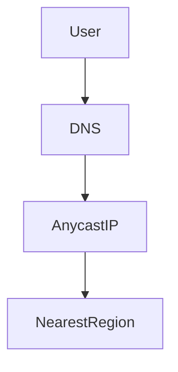
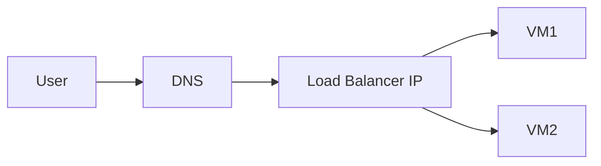

# DNS and IP Mapping in Google Cloud Platform (GCP)

This document explains **DNS resolution and IP address mapping in GCP**. It focuses on **how a request travels from a domain name to the correct VM**, covering **Cloud DNS, internal vs external DNS, zonal and global resolution, and IP translation**.

---

## 1. Why DNS and IP Mapping Exist

Humans use **names**. Networks use **IP addresses**.

- Humans type: `myapp.example.com`
- Machines need: `34.120.80.10`

DNS and IP mapping exist to **bridge this gap**.

> DNS answers **"What IP should I talk to?"**
> IP mapping answers **"Which internal machine should receive this traffic?"**

---

## 2. Big Picture: End-to-End Flow


This flow applies to **almost every cloud application**.

---

## 3. DNS Resolution (Name → IP)

### What DNS Does

DNS (Domain Name System) converts:

```
Domain name → IP address
```

Example:

```
myapp.com → 34.120.80.10
```

DNS **never routes traffic**. It only returns an IP.

---

## 4. Types of DNS in GCP

GCP uses **two main DNS scopes**:

1. **Public DNS** (internet-facing)
2. **Private DNS** (inside VPC)

---

## 5. Public DNS and Cloud DNS

### Public DNS (General Internet)

- Used by users on the internet
- Resolves public domain names
- Returns **external IP addresses**

### Cloud DNS (Public Zones)

Cloud DNS is Google’s **managed DNS service**.

You can create:

- Public DNS zones
- Custom domains

Example:

```
myapp.com → 34.120.80.10
```

---

### Public DNS Resolution Flow


---

## 6. Private DNS (Internal DNS)

### What is Private DNS?

Private DNS works **inside a VPC only**.

It resolves:

- VM names
- Internal service names
- Internal domains

And returns:

- **Internal IP addresses only**

---

### Default Internal DNS in GCP

GCP automatically provides an internal DNS namespace.

Example:

```
vm-1.us-central1-a.c.project.internal
```

Resolves to:

```
10.1.0.4
```

---

### Internal DNS Resolution Flow



---

## 7. Zonal, Regional, and Global DNS Resolution

### Zonal (VM-Level)

- VM hostname includes zone
- Resolves to VM’s internal IP

Example:

```
vm-1.us-central1-a.c.project.internal
```

---

### Regional (Service-Level)

- Refers to a service within a region
- Often used by managed services

Resolves to:

- Regional internal IPs

---

### Global (Load Balancer-Level)

- Used by global services
- Resolves to **anycast external IPs**



---

## 8. IP Mapping (External IP → Internal IP)

### Why Mapping Is Needed

- Internal IPs are **not reachable from the internet**
- External IPs act as **entry points**

GCP maps traffic using:

- NAT
- Load balancers

---

## 9. External IP Mapping Using NAT


Key idea:

> The VM never exposes its internal IP publicly.

---

## 10. IP Mapping Using Load Balancers (Most Common)



- DNS points to load balancer IP
- Load balancer selects backend VM
- VM uses internal IP only

---

## 11. Default Domains and IPs

### What Are Default Domains?

Default domains are **auto-generated domains** provided by GCP.

They exist for:

- Internal service discovery
- Managed services

You do not control their IPs.

---

### Internal Default Domains

- Resolve via private DNS
- Return internal IPs

Example:

```
vm-name.zone.project.internal → 10.x.x.x
```

---

### External Default Domains

- Resolve via public DNS
- Return Google-managed external IPs
- Often fronted by load balancers

IP addresses may change, but the **domain name remains stable**.

---

## 12. Why IPs Behind Domains Can Change

- Load balancing
- Scaling
- Failover
- Infrastructure updates

That’s why:

> Always rely on **DNS names**, not hard-coded IPs.

---

## 13. Final Mental Models

### Model 1 – Request Flow

```
Domain → External IP → Internal IP → VM
```

### Model 2 – DNS Scope

```
Public DNS → External IPs
Private DNS → Internal IPs
```

---

## 14. Summary

- DNS converts names to IPs
- Cloud DNS manages public and private zones
- Internal DNS resolves private names
- External IPs map to internal IPs via NAT or load balancers
- Domains stay stable; IPs may change

---

End of `dns_&_ip_mapping.md`
