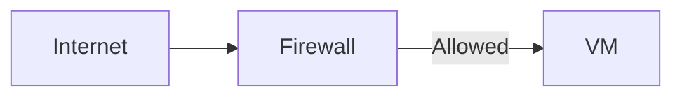
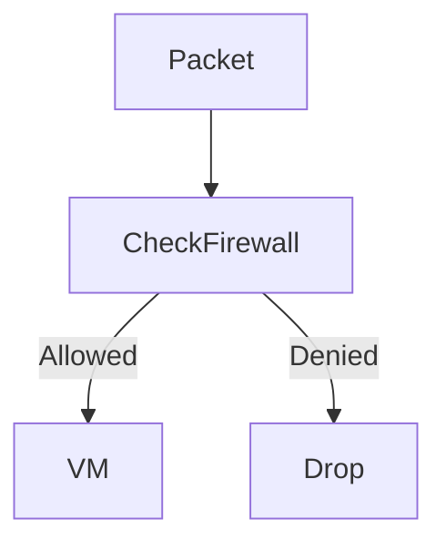

# Firewall Rules in Google Cloud Platform (GCP)

This document explains **firewall rules in GCP**. You will learn **what firewalls are, how GCP firewall rules work, and how to design safe networking rules**.

---

## 1. What is a Firewall? (Very Basic)

A **firewall** decides:

> **"Is this traffic allowed or blocked?"**

Firewalls protect resources from:

- Unauthorized access
- Accidental exposure
- Malicious traffic

---

## 2. Where Firewalls Exist in GCP

- Firewall rules belong to a **VPC network**
- They apply to **VMs and resources** in that VPC
- Controlled centrally

---

## 3. Default Firewall Behavior

### Ingress (Incoming)

- **DENY all** by default

### Egress (Outgoing)

- **ALLOW all** by default

This makes GCP **secure by default**.

---

## 4. Types of Firewall Rules

### 4.1 Ingress Rules

Control incoming traffic.

Example:

```
Allow TCP 22 from 0.0.0.0/0
```



---

### 4.2 Egress Rules

Control outgoing traffic.

Example:

```
Allow TCP 443 to 0.0.0.0/0
```

---

## 5. Components of a Firewall Rule

Each rule defines:

- Direction (Ingress/Egress)
- Action (Allow)
- Source or destination
- Protocol and ports
- Target (tags or service accounts)
- Priority

---

## 6. Targeting Firewall Rules

### Using Network Tags

```text
Target tag: web-server
```

### Using Service Accounts

```text
Target service account: web-sa
```

This avoids opening rules to all VMs.

---

## 7. Firewall Rule Priority

- Lower number = higher priority
- First matching rule wins

---

## 8. Firewall Evaluation Flow



---

## 9. Best Practices

- Allow minimum required traffic
- Avoid 0.0.0.0/0 when possible
- Use tags or service accounts
- Separate ingress and egress rules

---

## 10. Summary

- Firewalls decide **permission**
- Routes decide **direction**
- GCP firewalls are centralized and stateful

---

End of `firewall_rules.md`
