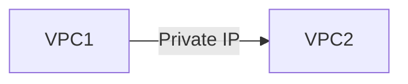

# VPC Peering, Cloud VPN, and Interconnect in GCP

This document explains **VPC Peering, Cloud VPN, and Interconnect** from a **complete beginner perspective**. These services solve one core problem:

> **How do we connect networks together securely?**

We will cover **what each option is, when to use it, how traffic flows, pricing intuition, and common beginner mistakes**, with simple diagrams.

---

## 1. The Core Connectivity Problem

In real-world systems, networks are rarely isolated.

You may need to connect:

- One VPC to another VPC
- GCP to on‑premises data center
- GCP to another cloud

These connections must be:

- Secure
- Reliable
- Predictable

GCP provides **three main solutions**, each for a different scenario.

---

## 2. Overview: When to Use What

| Use Case                   | Solution     |
| -------------------------- | ------------ |
| VPC ↔ VPC (GCP)            | VPC Peering  |
| GCP ↔ On‑prem (encrypted)  | Cloud VPN    |
| GCP ↔ On‑prem (high speed) | Interconnect |

---

## 3. VPC Peering

### 3.1 What Is VPC Peering?

**VPC Peering** connects two VPC networks so that:

- They communicate using **private IPs**
- Traffic stays on **Google’s private backbone**
- No public internet is involved

> Think of VPC Peering as a **private bridge between two VPCs**.

---

### 3.2 VPC Peering Traffic Flow



Key characteristics:

- No NAT
- No gateway appliance
- No bandwidth bottleneck

---

### 3.3 Important Rules of VPC Peering

- CIDR ranges **must not overlap**
- Peering is **non‑transitive**
- Firewall rules still apply
- Routes are automatically exchanged

---

### 3.4 Common Use Cases

- Microservices split across VPCs
- Shared services VPC
- Organizational network separation

---

## 4. Cloud VPN

### 4.1 What Is Cloud VPN?

**Cloud VPN** creates an **encrypted tunnel (IPsec)** between:

- A GCP VPC
- An on‑premises or external network

> Think of Cloud VPN as a **secure tunnel over the public internet**.

---

### 4.2 Cloud VPN Traffic Flow


Key properties:

- Traffic travels over the internet
- Fully encrypted
- Managed by Google

---

### 4.3 Types of Cloud VPN

- **Classic VPN** (older)
- **HA VPN** (recommended)

HA VPN provides:

- High availability
- SLA-backed reliability

---

### 4.4 When to Use Cloud VPN

- Hybrid connectivity (on‑prem ↔ GCP)
- Low to moderate bandwidth needs
- Cost-sensitive setups

---

## 5. Interconnect

### 5.1 What Is Interconnect?

**Interconnect** is a **physical network connection** between:

- Your on‑prem data center
- Google’s network

> Think of Interconnect as a **private fiber cable** into Google.

---

### 5.2 Interconnect Traffic Flow


Key characteristics:

- Does NOT use the public internet
- Extremely low latency
- Very high bandwidth

---

### 5.3 Types of Interconnect

- **Dedicated Interconnect** (direct physical connection)
- **Partner Interconnect** (via service provider)

---

### 5.4 When to Use Interconnect

- High throughput requirements
- Latency-sensitive workloads
- Large enterprise environments

---

## 6. Comparison: Peering vs VPN vs Interconnect

| Feature       | VPC Peering  | Cloud VPN | Interconnect |
| ------------- | ------------ | --------- | ------------ |
| Uses internet | No           | Yes       | No           |
| Encryption    | No (private) | Yes       | Optional     |
| Latency       | Very low     | Medium    | Very low     |
| Bandwidth     | High         | Limited   | Very high    |
| Cost          | Low          | Medium    | High         |

---

## 7. Routing and Firewalls (Very Important)

Regardless of connectivity method:

- **Routes determine path**
- **Firewall rules determine access**

Connectivity ≠ permission.

---

## 8. DNS Considerations

- VPC peering does **not** automatically share DNS
- Hybrid setups may need DNS forwarding
- Cloud DNS private zones are commonly used

---

## 9. Mental Models to Remember

```text
Peering = Private bridge (GCP ↔ GCP)
VPN = Secure tunnel (Internet)
Interconnect = Private highway (Fiber)
```

---

## 10. Simple Decision Guide

```text
Need GCP ↔ GCP? → VPC Peering
Need secure hybrid? → Cloud VPN
Need speed + scale? → Interconnect
```

---

## 11. Summary

- GCP offers multiple connectivity options
- Each solves a different problem
- Correct choice depends on scale, security, and cost
- Good network design starts with CIDR planning

---

End of `vpc_peering_vpn_interconnect.md`
