# End-to-End Request Trace in GCP

This document explains **how a single user request travels end-to-end through Google Cloud Platform (GCP)**. It ties together **DNS, IP addressing, load balancing, routing, firewalls, NAT, private access, and backend services** into one coherent flow.

By the end, you should be able to **mentally trace any request** and know exactly _where it goes_, _what decides its path_, and _what can block or allow it_.

---

## 1. The Scenario We Will Trace

Let’s use a **realistic production-style example**.

### Setup

- User accesses: `https://app.example.com`
- Application is hosted on GCP
- Uses:

  - Custom domain
  - Global HTTP(S) Load Balancer
  - Backend VMs in a private subnet
  - No external IPs on VMs
  - Cloud NAT for outbound access

---

## 2. High-Level Flow (Bird’s Eye View)

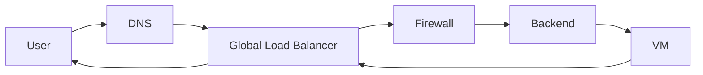

At no point does the user talk directly to the VM.

---

## 3. Step 1 – User Types the Domain Name

The journey starts when the user types:

```
https://app.example.com
```

Important:

- Browsers **do not understand domains**
- They only understand **IP addresses**

---

## 4. Step 2 – DNS Resolution (Name → IP)

### What Happens

1. Browser queries DNS resolver
2. Resolver contacts authoritative DNS
3. DNS returns an **external IP** of the load balancer

Example:

```
app.example.com → 34.120.90.10
```

### Diagram

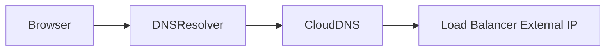

Key point:

> DNS only returns an IP. It does not send traffic.

---

## 5. Step 3 – Traffic Reaches Google Edge POP

The user sends traffic to `34.120.90.10`.

Behind the scenes:

- This IP is an **anycast IP**
- Traffic goes to the **nearest Google Edge POP**

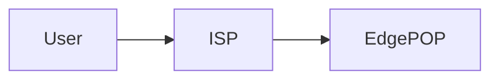

---

## 6. Step 4 – Global Load Balancer Receives Request

At the Edge POP:

- Google identifies the request
- Terminates TLS (HTTPS)
- Applies load balancer rules

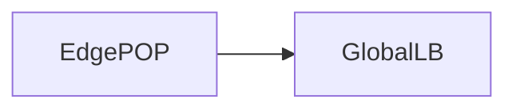

---

## 7. Step 5 – URL Mapping and Backend Selection

The load balancer:

- Checks URL maps
- Selects the correct backend service
- Chooses a **healthy backend VM**

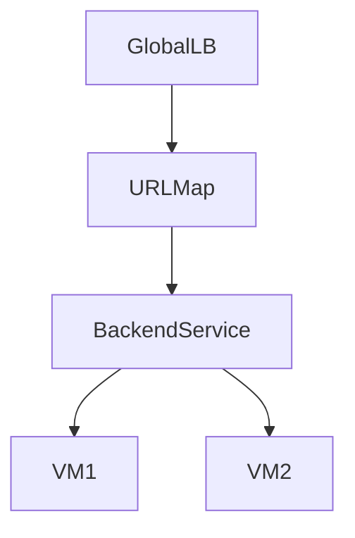

---

## 8. Step 6 – Routing Inside the VPC

Now traffic enters your VPC.

Routing decides:

- Which subnet the traffic goes to
- Which next hop to use

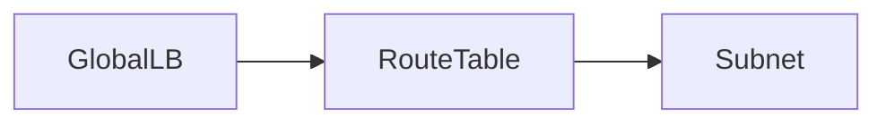

Important:

> Routes decide _where_ traffic goes, not whether it is allowed.

---

## 9. Step 7 – Firewall Evaluation

Before traffic reaches the VM:

- Firewall rules are evaluated
- Ingress rules must explicitly allow traffic

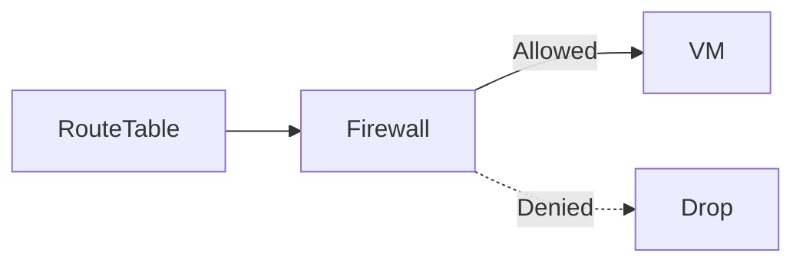

---

## 10. Step 8 – VM Receives the Request

The VM:

- Sees traffic coming from **internal IPs**
- Processes the request
- Generates a response

Important:

> The VM never sees the user’s public IP directly unless forwarded.

---

## 11. Step 9 – Response Travels Back

The response:

- Goes back to the load balancer
- Then back to the Edge POP
- Then to the user

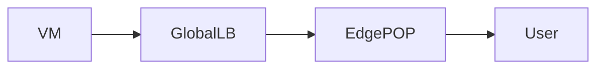

The user receives the response.

---

## 12. Outbound Requests from the VM (Cloud NAT)

Now assume the VM needs to:

- Call an external API
- Download updates

Since the VM has **no external IP**:

- Cloud NAT is used

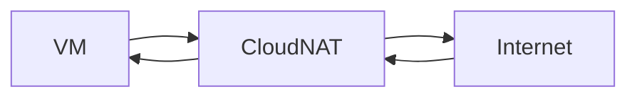

---

## 13. Accessing Google APIs (Private Google Access)

If the VM accesses:

- Cloud Storage
- Artifact Registry

And **Private Google Access is enabled**:

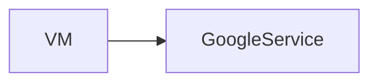

Traffic stays inside Google’s network.

---

## 14. What Could Block the Request? (Debug Mindset)

If something fails, check in this order:

1. DNS (wrong IP?)
2. Load balancer configuration
3. Health checks
4. Routes
5. Firewall rules
6. VM service/app

---

## 15. Same Flow Without Load Balancer (Simple Case)

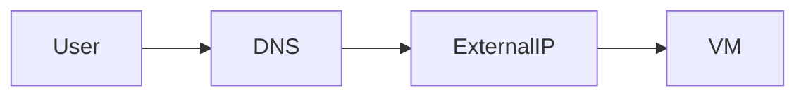

This is:

- Simpler
- Less secure
- Not recommended for production

---

## 16. Key Mental Models (Memorize These)

```text
DNS → Finds IP
LB → Chooses backend
Routes → Decide path
Firewalls → Decide access
VM → Handles logic
```

---

## 17. One-Sentence Summary

> An end-to-end request in GCP flows from **DNS → Google Edge → Load Balancer → VPC routing → Firewall → VM**, and back the same way.

---

End of `end_to_end_request_trace.md`
