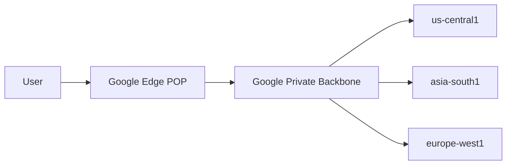
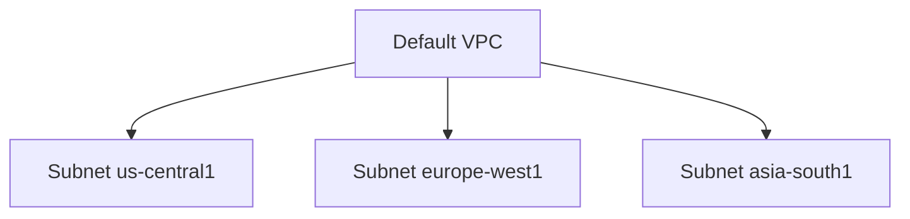
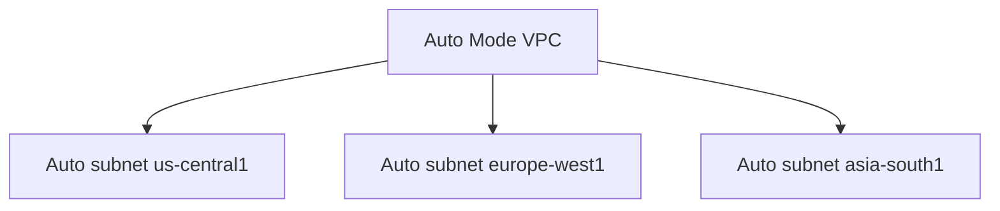
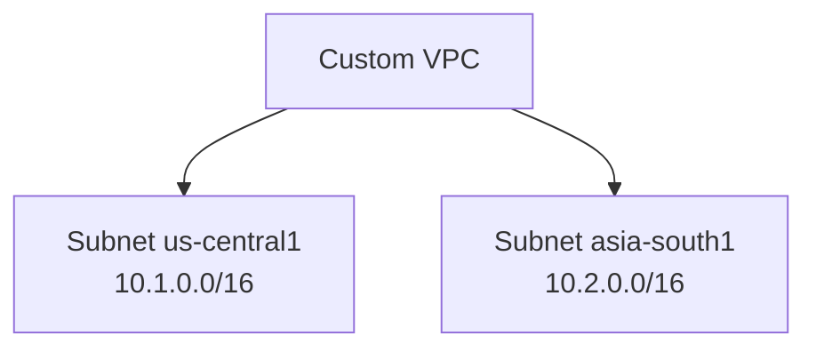

# Virtual Private Cloud (VPC) in GCP

This document is a **complete guide to VPC in GCP**. It explains **what a VPC is, why it exists, how it works**, and **types of VPCs**, with simple explanations and example diagrams.

---

## 1. What is a VPC?

A **Virtual Private Cloud (VPC)** is your **own private network inside Google Cloud**.

Think of a VPC as:

- A private data‑center network
- Defined using IP address ranges
- Fully controlled by you (routing, security, connectivity)

> Every VM, database, and internal service in GCP lives **inside a VPC**.

---

## 2. Key Properties of GCP VPC

GCP VPCs are **not like traditional networks**.

### Core properties

- **Global**: A single VPC can span multiple regions
- **Software‑defined**: No physical routers or switches
- **Highly scalable**: Designed for large systems
- **Private by default**: No public access unless allowed

---

## 3. Google Global Network (Foundation)

GCP VPCs run on **Google’s private global fiber network**.

### Why this matters

- Traffic between regions stays on Google’s backbone
- Lower latency
- Higher security

### Diagram: Global Network

---

## 4. VPC Network Types

GCP provides **three VPC network types** based on how subnets are created.

---

### 4.1 Default VPC

**Default VPC** is automatically created when a new GCP project is created.

#### What GCP creates automatically

- Subnets in **every region**
- Default firewall rules (SSH, RDP, ICMP)
- Default internet routes

#### Diagram

#### Use case

- Learning
- Demos

---

### 4.2 Auto Mode VPC

An **Auto Mode VPC** is created by the user, but:

- GCP automatically creates subnets
- One subnet per region
- IP ranges are assigned by GCP

#### Diagram

#### Limitations

- No control over IP ranges
- Not suitable for large architectures

---

### 4.3 Custom Mode VPC (Recommended)

A **Custom Mode VPC** gives full control.

You decide:

- Which regions to use
- Subnet IP ranges
- Network structure

#### Diagram

#### Use case

- Production systems
- Enterprise workloads
- Shared VPC

---

### 4.4 VPC Types Comparison

| Feature              | Default | Auto Mode | Custom Mode |
| -------------------- | ------- | --------- | ----------- |
| Auto-created         | Yes     | No        | No          |
| Subnets auto-created | Yes     | Yes       | No          |
| IP control           | No      | No        | Yes         |
| Production ready     | No      | No        | Yes         |

---
