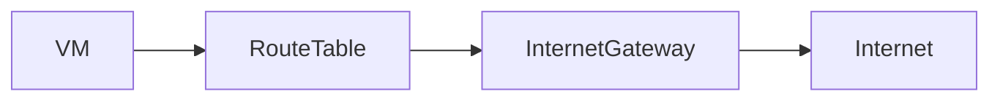
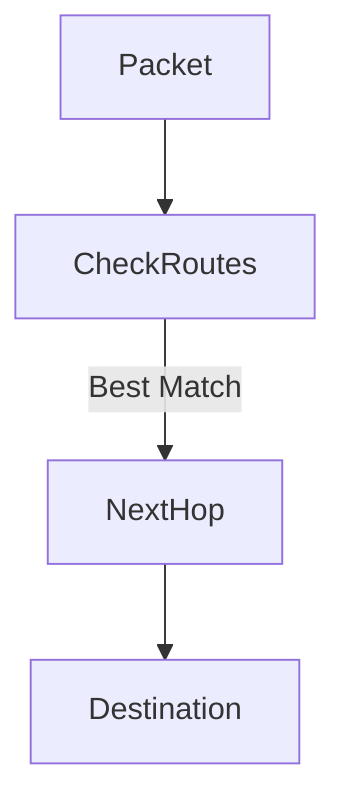

# Routes in Google Cloud Platform (GCP)

This document explains **routing in GCP**. It covers **what routes are, why they exist, how traffic flows inside a VPC, and how GCP routing differs from traditional networking**.

---

## 1. What is Routing? (Very Basic)

Routing answers one simple question:

> **"Where should this network traffic go?"**

Whenever a VM sends traffic, GCP looks at **routes** to decide:

- Should traffic stay inside the VPC?
- Should it go to the internet?
- Should it go through a VPN or peering?

---

## 2. Where Routes Exist in GCP

- Routes belong to a **VPC network**
- They apply to **all subnets and all zones** in that VPC
- Routes are **global** (even though subnets are regional)

---

## 3. Route Table (Mental Model)

Think of a **route table** as a list of rules checked in order.

Each route contains:

- **Destination CIDR** (where the traffic wants to go)
- **Next hop** (how to get there)
- **Priority** (lower number = higher priority)

---

## 4. Default Routes in Every VPC

Every VPC automatically has:

```text
0.0.0.0/0 → Default Internet Gateway
```

Meaning:

- Any traffic that does not match internal routes
- Goes to the internet

---

## 5. Types of Routes in GCP

### 5.1 Subnet Routes (Automatic)

- Created automatically when you create a subnet
- Allow communication **within the VPC**

Example:

```
10.1.0.0/16 → local subnet
```

---

### 5.2 Default Internet Route

- Enables outbound internet access
- Uses Google-managed internet gateway



---

### 5.3 Custom Static Routes

You can create routes manually for:

- VPN tunnels
- VPC peering
- Custom appliances

Example:

```
192.168.0.0/16 → VPN tunnel
```

---

### 5.4 Dynamic Routes

- Learned automatically via **Cloud Router**
- Used with VPN and Interconnect

---

## 6. Route Priority (Important)

- Lower number = higher priority
- Most specific route wins first

Example:

- `10.1.0.0/16` beats `0.0.0.0/0`

---

## 7. Routing Decision Flow



---

## 8. Routes vs Firewalls (Do Not Confuse)

| Routes             | Firewalls                  |
| ------------------ | -------------------------- |
| Decide path        | Decide permission          |
| Where traffic goes | Whether traffic is allowed |
| Always evaluated   | Evaluated after routing    |

---

## 9. Summary

- Routes decide **direction**
- Firewalls decide **permission**
- Routing happens before firewall checks

---

End of `routes.md`
