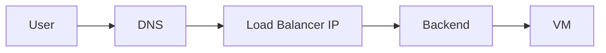
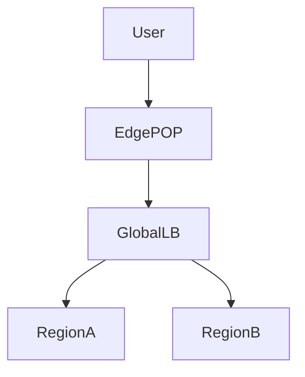
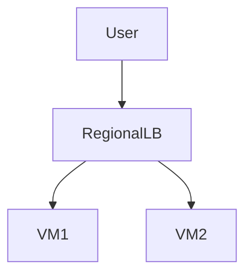
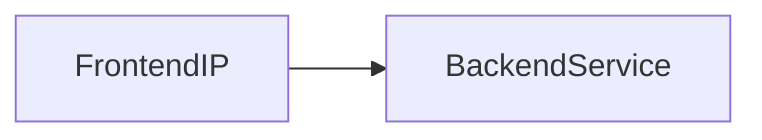
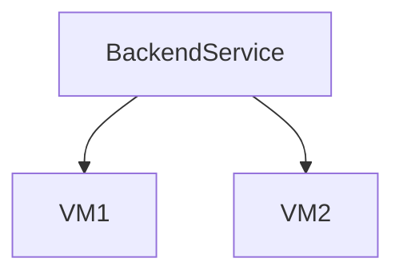
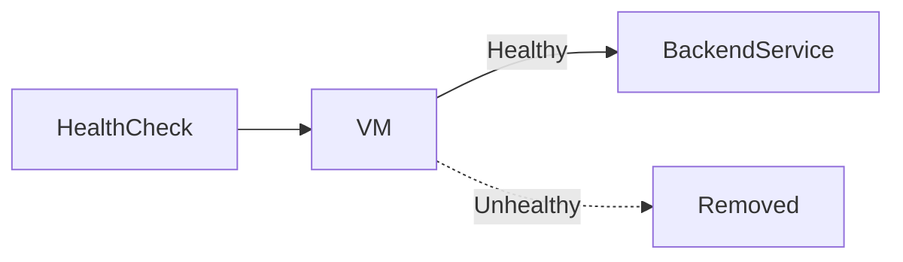
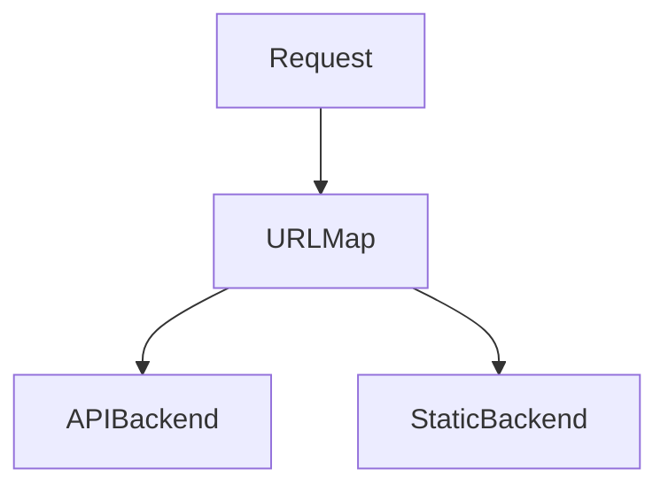
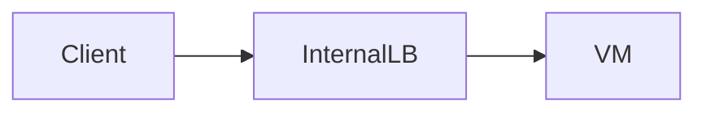
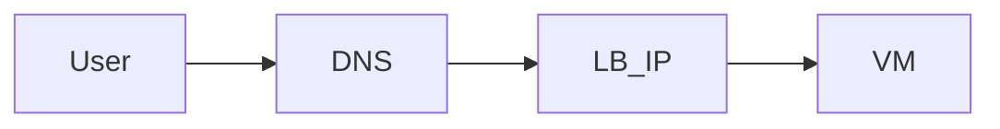
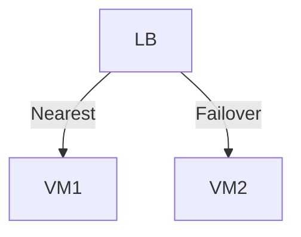

# Load Balancing in Google Cloud Platform (GCP)

This document explains **load balancing in GCP**. It covers **what load balancing is, why it is needed, how GCP load balancers work internally, and how DNS, IPs, health checks, and backends all fit together**.

---

## 1. What Is Load Balancing? (Very Basic)

Load balancing answers this question:

> **How do we distribute incoming traffic across multiple servers safely and efficiently?**

Without load balancing:

- One VM handles all traffic
- If it fails → application is down

With load balancing:

- Traffic is spread across multiple VMs
- Failures are handled automatically

---

## 2. Why Load Balancing Is Essential in the Cloud

Load balancing provides:

- High availability
- Scalability
- Fault tolerance
- Better performance

In cloud environments, load balancers are **foundational**, not optional.

---

## 3. Big Picture: End-to-End Traffic Flow



Users never talk to VMs directly.
They talk to the **load balancer**.

---

## 4. GCP Load Balancing Philosophy (Important)

GCP load balancers are:

- Software-defined
- Fully managed
- Integrated with Google’s global network

Many GCP load balancers are **global by default**, which is unusual compared to other clouds.

---

## 5. Global vs Regional Load Balancing

### Global Load Balancing

- One global IP address
- Traffic enters Google Edge POPs
- Routed over Google backbone



### Regional Load Balancing

- One region only
- Traffic stays within region



---

## 6. Types of Load Balancers in GCP

### Layer 7 (HTTP/HTTPS)

- Understands URLs, headers
- Used for web applications
- Supports path-based routing

### Layer 4 (TCP/UDP)

- Works at connection level
- Used for non-HTTP traffic

---

## 7. Core Components of a GCP Load Balancer

Every load balancer is built from **logical building blocks**.

---

### 7.1 Frontend

The **frontend** is the entry point.

It defines:

- IP address (external or internal)
- Port (80, 443, etc.)


---

### 7.2 Backend Services

Backend services define:

- Where traffic goes
- How traffic is distributed

Backends can be:

- VM instance groups
- Managed instance groups
- Serverless services



---

### 7.3 Backend (VMs)

Backends use **internal IPs only**.
They are never exposed directly.



---

### 7.4 Health Checks (Critical Concept)

Health checks answer:

> **Is this backend healthy and should it receive traffic?**

- Run continuously
- Remove unhealthy VMs automatically



---

### 7.5 URL Maps (HTTP Load Balancers)

URL maps define **routing logic**.

Example:

```
/api → backend-api
/static → backend-static
```



---

## 8. Internal vs External Load Balancers

### External Load Balancers

- Public IP address
- Internet-facing

### Internal Load Balancers

- Private IP address
- Used inside VPC



---

## 9. DNS and Load Balancers

DNS usually points to the **load balancer IP**, not to VMs.



DNS hides backend changes from users.

---

## 10. IP Addressing and Load Balancers

- Load balancers use **static IPs**
- Backends use **internal IPs**
- External IP → internal IP mapping is automatic

---

## 11. Load Balancer Traffic Distribution

Traffic is distributed based on:

- Health
- Capacity
- Proximity (global LB)



---

## 12. Failover and High Availability

If a VM fails:

- Health check fails
- Traffic is rerouted automatically

No manual intervention needed.

---

## 13. Security with Load Balancers

Load balancers integrate with:

- Firewall rules
- SSL/TLS termination
- Identity-aware proxy

They reduce direct exposure of VMs.

---

## 14. Mental Models to Remember

```text
User never talks to VM directly
DNS points to Load Balancer
Load Balancer talks to VMs using internal IPs
```

---

## 15. Summary

- Load balancers distribute traffic
- GCP supports global and regional LBs
- DNS + LB hide backend complexity
- Health checks control traffic flow
- Load balancing is core to cloud design

---

End of `load_balancer.md`
