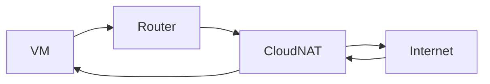
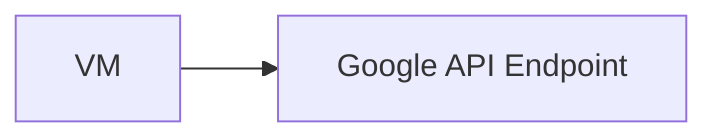
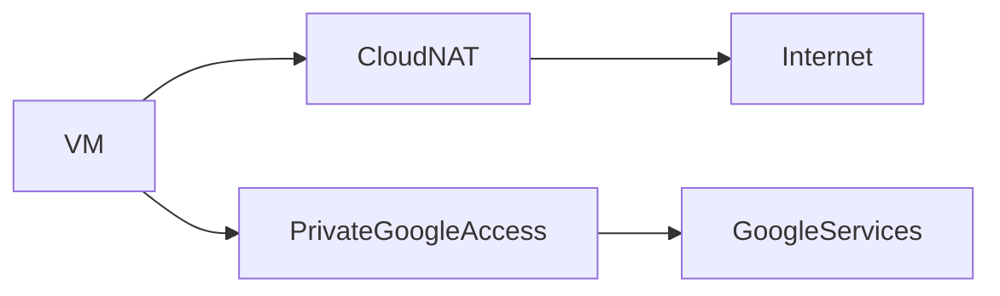

# Cloud NAT and Private Google Access in GCP

This document explains **Cloud NAT and Private Google Access** from a **complete beginner perspective**. It focuses on **why these services exist, what problems they solve, how they work internally, and how traffic flows**, with clear mental models and diagrams.

---

## 1. The Core Problem (Start Here)

By default:

- VMs in a VPC have **internal (private) IPs**
- Private IPs **cannot access the public internet**

But in real systems, private VMs still need to:

- Download OS updates
- Pull Docker images
- Call Google APIs

So we need a way to:

> **Allow outbound access without exposing the VM publicly**

This is where **Cloud NAT** and **Private Google Access** come in.

---

## 2. What Is Cloud NAT?

**Cloud NAT (Network Address Translation)** allows:

- VMs with **only internal IPs**
- To access the **public internet outbound**
- Without allowing inbound internet access

### Very simple definition

> Cloud NAT is a **one‑way internet door** for private VMs.

---

## 3. Why Cloud NAT Exists

Without Cloud NAT, you would need to:

- Assign **external IPs** to VMs
- Expose them to the internet

Cloud NAT solves this by:

- Keeping VMs private
- Centralizing outbound access
- Improving security

---

## 4. Cloud NAT Traffic Flow (High Level)

```mermaid
graph LR
    PrivateVM[VM (Internal IP)] --> NAT[Cloud NAT]
    NAT --> Internet
```

Key points:

- Traffic can go **out**
- Responses can come **back**
- Internet **cannot initiate** traffic to VM

---

## 5. How Cloud NAT Works (Step by Step)

1. VM sends traffic to the Router
2. Router sends traffic to Cloud NAT
3. Cloud NAT replaces:

   - Source internal IP → public IP

4. Internet responds to public IP
5. Cloud NAT maps response back to VM



---

## 6. Important Properties of Cloud NAT

- **Outbound only**
- No inbound connections allowed
- Scales automatically
- Highly available
- Uses Google‑managed IPs or your own static IPs

---

## 7. Cloud NAT vs External IP (Critical Comparison)

| Feature               | External IP | Cloud NAT |
| --------------------- | ----------- | --------- |
| VM publicly reachable | Yes         | No        |
| Inbound traffic       | Allowed     | Blocked   |
| Security              | Lower       | Higher    |
| Recommended for prod  | ❌          | ✅        |

---

## 8. What Is Private Google Access?

**Private Google Access** allows:

- VMs with only internal IPs
- To access **Google APIs and services**
- Without using the public internet

### Simple definition

> Private Google Access is a **private door to Google services**.

---

## 9. Why Private Google Access Exists

Many Google services:

- Cloud Storage
- BigQuery
- Artifact Registry

Are public services by default.

Private Google Access lets you:

- Call them privately
- Avoid external IPs
- Keep traffic inside Google’s network

---

## 10. Private Google Access Traffic Flow



Behind the scenes:

- Traffic stays on Google backbone
- No internet gateway involved

---

## 11. Cloud NAT vs Private Google Access (Do Not Confuse)

| Cloud NAT             | Private Google Access      |
| --------------------- | -------------------------- |
| Internet access       | Google APIs only           |
| Uses public IPs       | Uses private routing       |
| Needed for OS updates | Needed for Google services |

They solve **different problems** and are often used together.

---

## 12. Using Cloud NAT and Private Google Access Together

Most real systems use both.



---

## 13. Configuration Concept (High Level)

### Cloud NAT requires:

- VPC network
- Subnet(s)
- Cloud Router
- NAT configuration

### Private Google Access requires:

- Enabled flag on subnet

---

## 14. Mental Models to Remember

```text
Cloud NAT = Outbound internet only
Private Google Access = Private Google APIs
```

---

## 15. Summary

- Cloud NAT enables secure outbound internet access
- Private Google Access enables private access to Google services
- Neither exposes VMs publicly
- Both are essential for production architectures

---

End of `cloud_nat_and_private_google_access.md`
