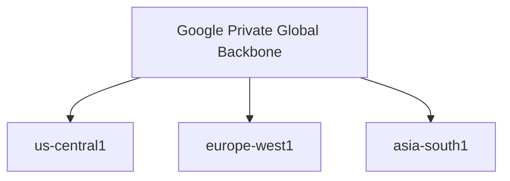
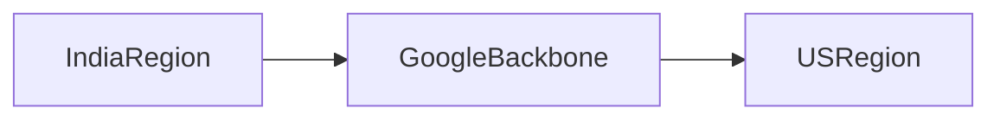
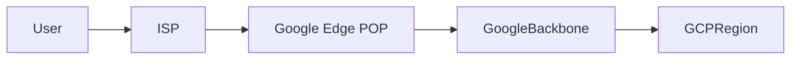
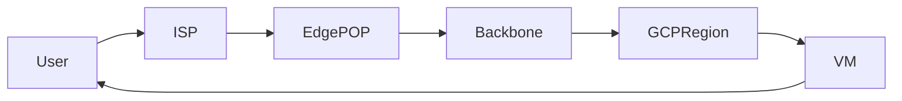

# Google's Private Global Fiber Network or Google's Private Backbone

## Start with the Internet (Normal World)

When **you open a website** in the normal internet world:

```
Your Laptop
   ↓
Local ISP (Airtel / Jio)
   ↓
Multiple unknown networks
   ↓
Another ISP
   ↓
Website server
```

### Problems with the normal internet

- Traffic jumps across **many companies’ networks**
- Paths are unpredictable
- Congestion, packet loss, latency
- Security depends on many intermediaries

This is the **public internet**.

---

## What Google Did Differently (Big Picture)

Google decided very early:

> “Instead of using the public internet, we’ll build our **own global internet**.”

> **GCP**: Global network first → regions are endpoints on one global private network

So Google built:

- **Undersea cables**
- **Land fiber cables**
- **Private data centers**
- **Private routers**

All **owned and controlled by Google**.

This entire thing together is called:

> **Google’s Private Global Fiber Network (or Backbone)**

---

# How Google (GCP) Built Networking

## Google’s Philosophy

Google started as:

- A **global internet company** (Search, YouTube, Gmail)
- Serving users **all over the world at once**

So Google built:

> **One massive private global fiber network first**, then placed data centers on top of it.

---

## GCP Networking Model (Conceptual)



### Key idea

- The **network is global**
- Regions are just **locations attached to the same network**

---

## What This Enables in GCP

Because the network is global:

- VPCs are **global**
- Subnets are regional, but **connected by default**
- Load balancers can be **global**
- Anycast IPs are natural

---

## 1. Google’s Private Global Fiber Network (Layman Explanation)

### Simple analogy

Imagine:

- The public internet = **public roads**
- Google’s private network = **private express highways**

Only Google’s traffic is allowed on these highways.

### What it actually is

- Physical fiber optic cables
- Spanning continents and oceans
- Connecting Google data centers worldwide

### Why it matters

- Faster (no traffic jams)
- More reliable
- More secure

### Simple diagram

```text
Public Internet:
City A -- City B -- City C -- City D

Google Backbone:
City A ======================= City D
```

One direct, controlled path.

---

## 2. What is the “Backbone”?

### In very simple terms

A **backbone** is the **main highway** of a network.

For Google:

- The backbone connects all Google regions
- All GCP regions sit on this backbone

So when:

- VM in India talks to VM in US
  The traffic **never touches the public internet**.

### Diagram



---

## 3. What is a Google Edge POP?

### POP = Point of Presence

A **Google Edge POP** is:

- A Google facility close to users
- Located in major cities
- Where your traffic **enters Google’s network**

### Layman explanation

Think of an Edge POP as:

- A **toll gate** to Google’s private highway

Once your request reaches a POP:

- It is immediately moved off the public internet
- And onto Google’s private backbone

---

## 4. Why Edge POPs Exist

Without POPs:

- Users would have to travel far to reach Google
- Latency would be high

With POPs:

- Google comes **closer to the user**
- Faster response times

### Diagram



---

## 5. Edge POP vs Data Center

| Edge POP                 | Data Center             |
| ------------------------ | ----------------------- |
| Close to users           | Large regional facility |
| Entry point              | Compute & storage       |
| Handles routing, caching | Runs VMs, databases     |
| Low latency              | High capacity           |

---

## 6. End-to-End Flow (User → VM)

Let’s trace one request:

```text
1. User types example.com
2. Request goes to nearest Google Edge POP
3. Traffic enters Google’s private backbone
4. Routed to closest healthy GCP region
5. VM processes request
6. Response returns via same backbone
```

### Diagram



---

## 7. Why This Is a Big Deal (In Plain English)

### Performance

- Fewer hops
- Shorter paths
- Predictable latency

### Reliability

- Google controls the entire path
- No dependency on random ISPs

### Security

- Traffic leaves public internet quickly
- Reduced exposure to attacks

---

## 8. Why Other Clouds Are Different

- **GCP**: Global network first
- **AWS/Azure**: Region-first, stitched together

That’s why:

- GCP VPCs are **global**
- GCP load balancers are **global by default**

---

## 9. One-Sentence Summary (Memorize This)

> **Google’s private backbone is a global, private highway network that your traffic enters through nearby Google Edge POPs, avoiding the public internet as much as possible.**

> **GCP** built a **global private network** first, then placed regions on top of it, so regions are automatically connected.
