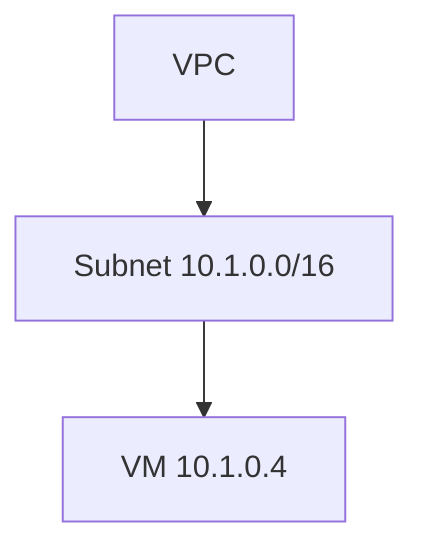
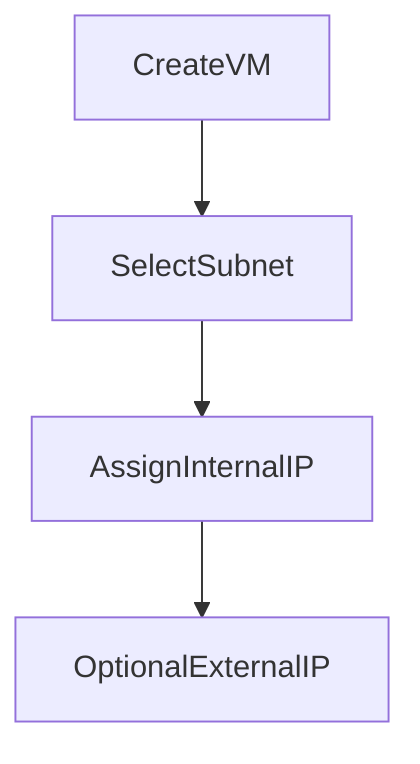

# IP Addressing in Google Cloud Platform (GCP)

This document explains **IP addressing in GCP**. By the end, you should clearly understand **what IP addresses are, why they exist, how GCP assigns them, and how to design IP ranges correctly**.

---

## 1. What is an IP Address?

An **IP address** is a **unique identifier** used by machines to communicate over a network.

Think of it like:

- Your **house address** for postal delivery
- A **phone number** for calling someone

In networking:

> IP address = where traffic should be delivered

---

## 2. Why IP Addressing Matters in GCP

Every resource in GCP that communicates over a network needs an IP address:

- Virtual Machines (VMs)
- Load balancers
- Internal services
- Hybrid connections

GCP IP addressing is designed to be:

- Scalable
- Secure
- Cloud‑native

---

## 3. Types of IP Addresses in GCP (Big Picture)

Every VM can have:

1. **Internal IP address** (private)
2. **External IP address** (public)

Each IP can be:

- **Ephemeral** (temporary)
- **Static** (reserved)

This creates **four combinations**.

---

## 4. Internal IP Addresses

### What is an Internal IP?

- Used **inside a VPC network**
- Not reachable from the internet
- Based on **private IP ranges** (RFC 1918)

Examples:

```
10.0.0.5
192.168.1.10
```

### Where Internal IPs Come From

Internal IPs are allocated from **subnet IP ranges**.



---

### Ephemeral Internal IP

- Automatically assigned when VM is created
- Released when VM is deleted
- Default behavior

Use cases:

- Most workloads
- Stateless services

---

### Static (Custom) Internal IP

- Manually chosen from subnet range
- Remains fixed
- Must be unused

Use cases:

- Databases
- Internal APIs
- Stateful services


---

## 5. External IP Addresses

### What is an External IP?

- Publicly reachable IP address
- Used for internet communication
- Managed by Google

Example:

```
34.120.45.12
```

---

### Ephemeral External IP

- Automatically assigned
- Changes when VM stops or is recreated
- Free while attached to a running VM

Use cases:

- Testing
- Temporary access


---

### Static (Reserved) External IP

- Reserved explicitly
- Fixed public IP
- Charged when unused

Use cases:

- Production services
- DNS records
- APIs


---

## 6. Comparison: Internal vs External IP

| Feature  | Internal IP | External IP      |
| -------- | ----------- | ---------------- |
| Scope    | Inside VPC  | Public internet  |
| Default  | Yes         | Optional         |
| Security | Private     | Public           |
| Cost     | Free        | Charged (static) |

---

## 7. Ephemeral vs Static IPs

| Feature                | Ephemeral           | Static          |
| ---------------------- | ------------------- | --------------- |
| Assigned automatically | Yes                 | No              |
| Can change             | Yes                 | No              |
| Best for               | Temporary workloads | Stable services |

---

## 8. CIDR Blocks (Most Important Concept)

### What is CIDR?

CIDR (Classless Inter‑Domain Routing) defines **IP ranges**.

Example:

```
10.1.0.0/16
```

### How to Read CIDR

- `10.1.0.0` → network base address
- `/16` → number of network bits

More bits = fewer IPs

---

### Common CIDR Sizes

| CIDR | Number of IPs |
| ---- | ------------- |
| /24  | 256           |
| /20  | 4,096         |
| /16  | 65,536        |

---

## 9. Subnet IP Ranges

Each subnet must have:

- One CIDR range
- No overlap with other subnets

Example:

```
Subnet us-central1: 10.1.0.0/16
Subnet asia-south1: 10.2.0.0/16
```

---

## 10. Reserved IPs Inside Subnets

GCP reserves some IPs automatically:

- Network address
- Gateway
- Broadcast (conceptual)

You cannot assign these to VMs.

---

## 11. How IPs Are Assigned to VMs (Flow)



---

## 12. How to Configure IP Addresses (Conceptual)

### During VM Creation

- Choose subnet
- Auto or manual internal IP
- Ephemeral or static external IP

### After VM Creation

- Internal IP cannot be changed
- External IP can be detached or replaced

---

## 13. Best Practices (Beginner Friendly)

- Prefer **internal IPs**
- Avoid external IPs when possible
- Use **Cloud NAT** for outbound internet
- Plan CIDR ranges early
- Use static IPs only when needed

---

## 14. Mental Model to Remember

```text
Subnet = IP pool
VM = gets one IP from the pool
Internal IP = private identity
External IP = public identity
```

---

## 15. Summary

- IP addressing is the foundation of networking
- Internal IPs are default and safe
- External IPs expose resources publicly
- CIDR defines IP ranges
- Good IP planning prevents future problems

---
